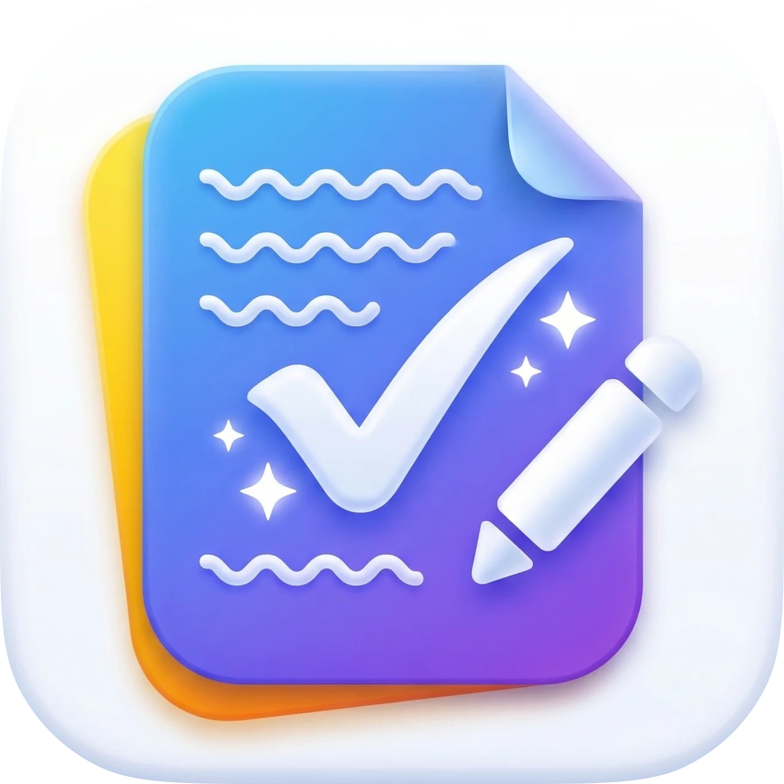

  

<h1 align="center">Rewrite</h1>

Fix grammar and spelling in any selected text with one keystroke. 
A lightweight macOS menu bar app powered by Claude.

<strong>Version 1.1.0</strong> · macOS 13+ · Apple Silicon & Intel

<a href="https://github.com/madebysan/rewrite/releases/latest"><strong>Download Rewrite</strong></a>

---

## How It Works

1. Select text anywhere on your Mac (Notes, Mail, Slack, VS Code, etc.)
2. Press **Cmd + Shift + R**
3. The text is corrected in place – grammar, spelling, and punctuation fixed instantly

No app switching. No copy-pasting. Just select, press, done.

## Setup

1. **Download** the DMG from [Releases](https://github.com/madebysan/rewrite/releases/latest)
2. **Drag** Rewrite.app to Applications
3. **Launch** Rewrite – it will appear in your menu bar
4. **Enter your API key** – you'll need an [Anthropic API key](https://console.anthropic.com/settings/keys)
5. **Grant permissions** – macOS requires two permissions for Rewrite to work:
   - **Accessibility** (System Settings → Privacy & Security → Accessibility) – allows Rewrite to copy and paste text
   - **Input Monitoring** (System Settings → Privacy & Security → Input Monitoring) – allows the global keyboard shortcut to work in any app
6. **Relaunch** Rewrite after granting both permissions

> **Note:** If the shortcut stops working after an update, remove and re-add Rewrite in both permission lists, then relaunch.

## Features

- **Global shortcut** – works in any app, even when Rewrite is in the background
- **Clipboard preserved** – your clipboard is saved and restored after each rewrite
- **Visual feedback** – menu bar icon animates while rewriting, shows a warning on errors
- **Error notifications** – get a macOS notification if something goes wrong
- **Customizable prompt** – edit the rewriting instructions in Settings
- **Customizable shortcut** – change the hotkey in Settings
- **Launch at login** – optional, toggle in Settings
- **Fast** – uses Claude Haiku for ~1s response times
- **Cheap** – costs ~$0.0002 per rewrite (pennies per month)

## Requirements

- macOS 13 (Ventura) or later
- An [Anthropic API key](https://console.anthropic.com/settings/keys)
- Accessibility permission (required to simulate copy/paste)
- Input Monitoring permission (required for global keyboard shortcut)

## Tech Stack

- Swift + AppKit
- Claude API (Haiku)
- [HotKey](https://github.com/soffes/HotKey) for global shortcuts
- Zero other dependencies

## License

[MIT](LICENSE)

---

Made by [santiagoalonso.com](https://santiagoalonso.com)
